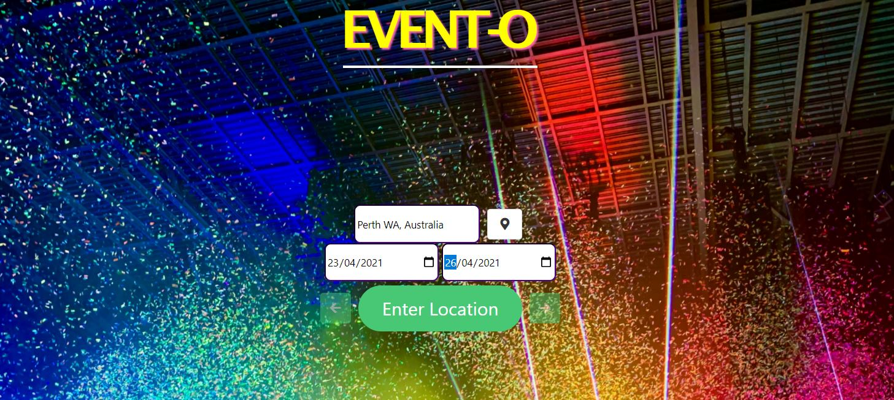
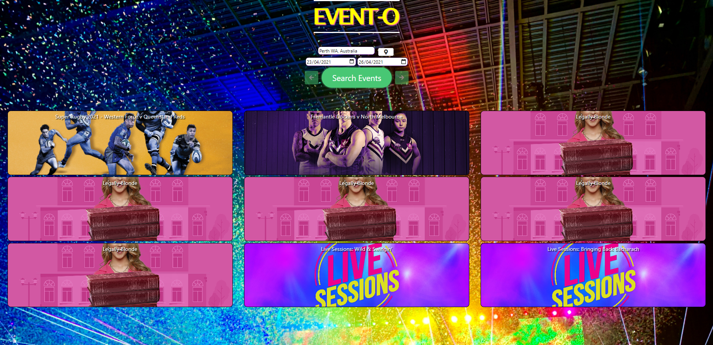
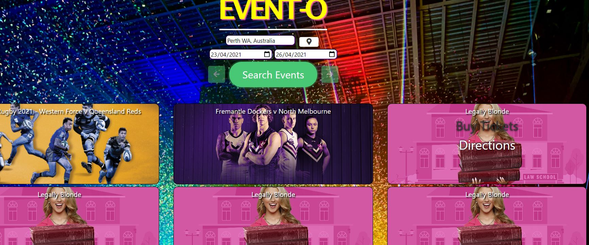
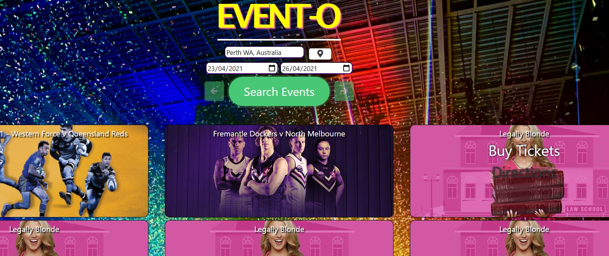

# Event-O 

### Project #1

UWA Full Stack Flex Bootcamp Feb 2021
by Jacob Hegan, Ricky Gobby, Danni Wilton

[GitHub Pages](https://au-rizer.github.io/Event-Searcher/)

[Event Searcher Repository](https://github.com/Au-RiZeR/Event-Searcher)

[Event-O Slides](https://docs.google.com/presentation/d/1PerBTD6kIpR74oLyyScU0KzERIGdDcm654_TmQ0n5js/edit#slide=id.p)

[Press-Release](./marketing/misc/press-release-v2.md)

---

## The Task

Trying to find a LIVE event to attend can be quite challenging, especially for those of us who just want to browse events to see what is on. Currently, there's a heavy reliance on social media to find event information. When you do not want to use social media looking for these LIVE events sends you down a rabbit hole of clicks and opening new tabs to websites, having to put in your details when all you want to do is see what is on.

### USER STORY
```
- AS AN event seeker!
- I WANT to find events easily online with very little hassle
- SO THAT I can attend future events
```

### APPLICATION CRITERIA
```
- GIVEN a event searcher with form inputs
- WHEN I search for a city and indicate dates
- THEN I am presented with events during that date period within that location
- WHEN I hover over the event image
- THEN I am presented with links directing me to the booking website to buy tickets and directions on how to get to the event
- WHEN I refresh the page
- THEN my previous location search is saved
```


## The Screenshots


---



---



---



---

END